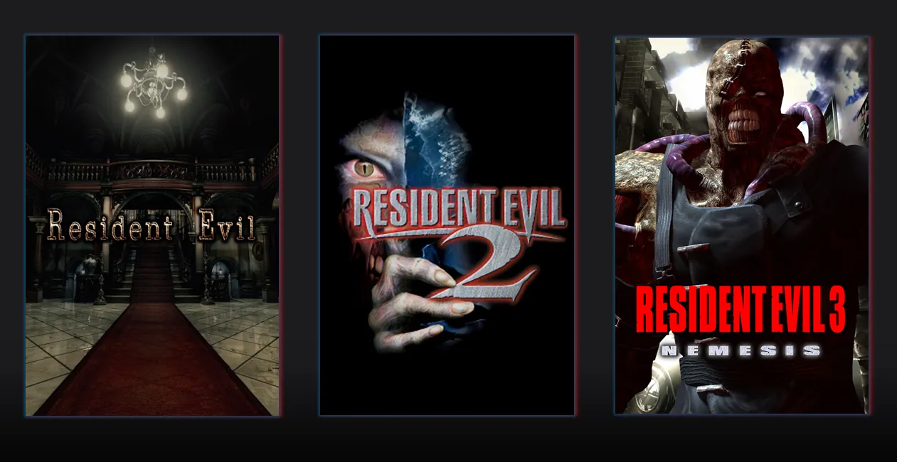
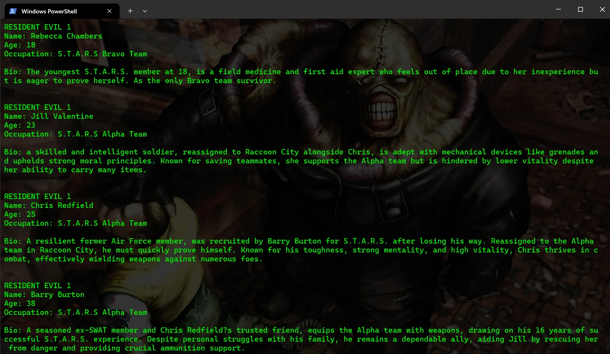
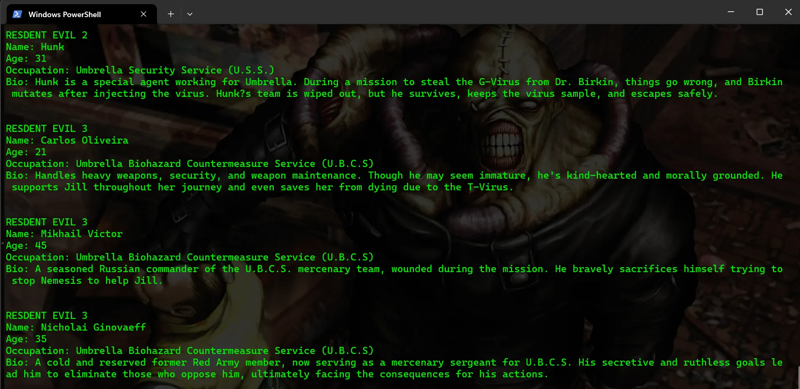
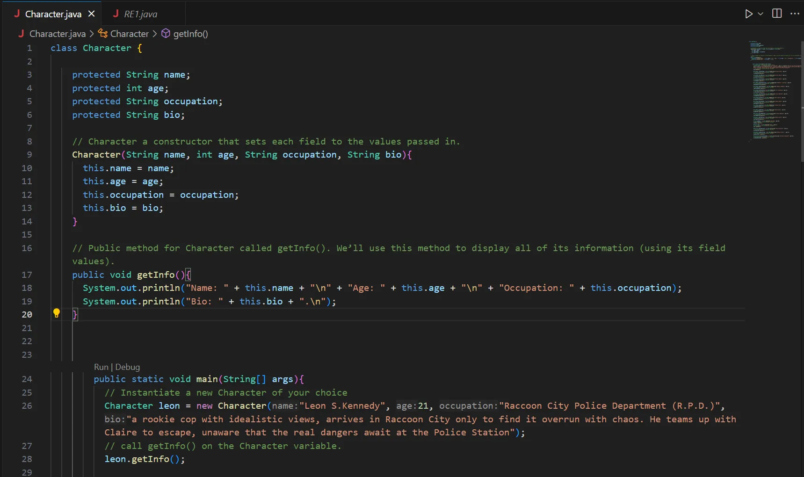
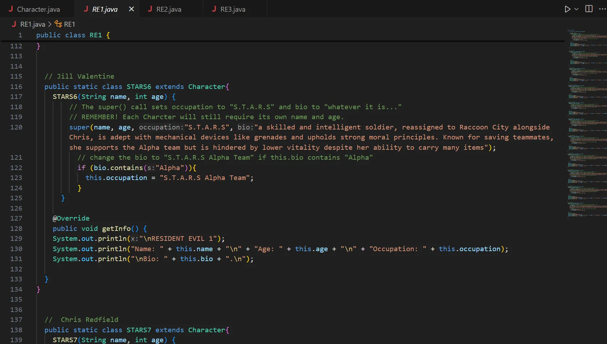
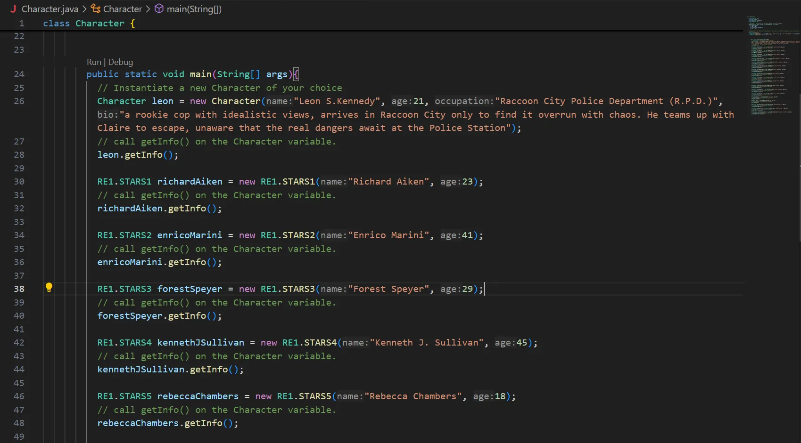

## 📄 Description

This is a Java project where I applied the principles of Inheritance and Polymorphism to build a structured database featuring the main characters from the Original Resident Evil Trilogy.

* 🚫🤖 No AI code 

## 📋 How to compile and run a .java file

1. Download JDK 
 ** https://www.oracle.com/java/technologies/downloads/

2. Set the environment PATH variable in PowerShell:
 ** [System.Environment]::SetEnvironmentVariable("Path", $env:Path + ";<path to the JDK bin>", "User")

4. Check Javac and Java are properly installed:
    ** In PowerShell insert the commands: 
    ** javac -version
    ** java -version

5. Write your Java program

6. Compile the .java file using Javac on the terminal
    ** javac <file name>.java

7. Run the program 
    ** java <file name> 
    ** (don’t include the extension in the file name)

## 📷 Screenshots

  

